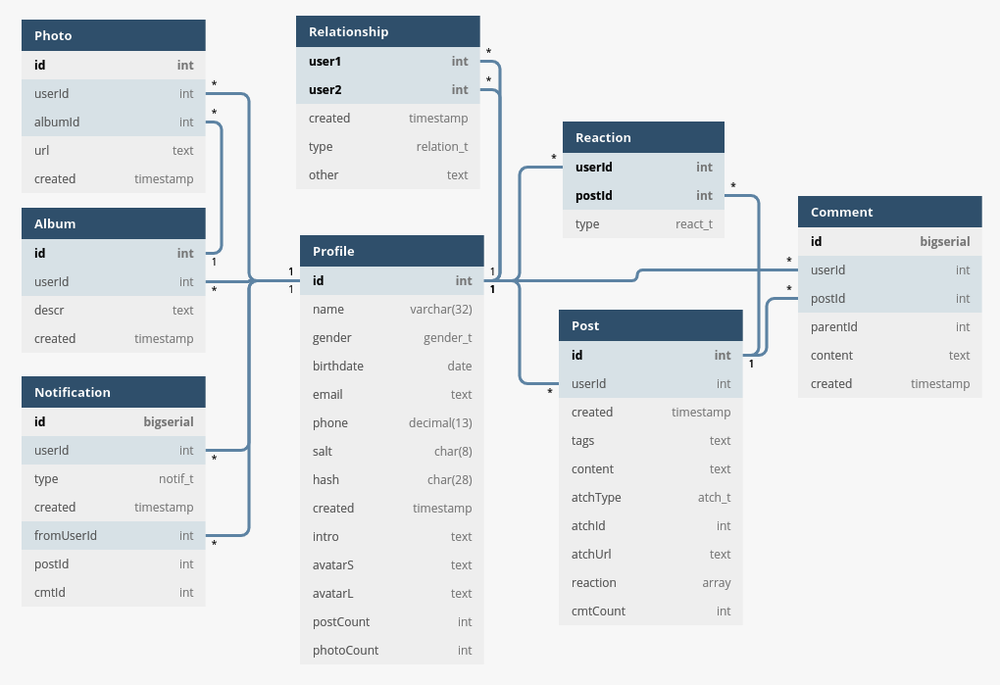

# Прототип социальной сети

# 1. Use-Case - диаграмма

# 2. ER-диаграмма сущностей

# 3. Описание типа приложения и выбранного технологического стека

- Web SPA
- Backend: Go
- Frontend: VueJs
- Database: Postgresql

# 4. UML диаграммы классов

## Компонента доступа к данным

## Компонента с бизнес-логикой

# 5. UML диаграммы «модельных» классов сущностей

## Сущности базы данных

## Сущности системы

## Транспортные сущности
